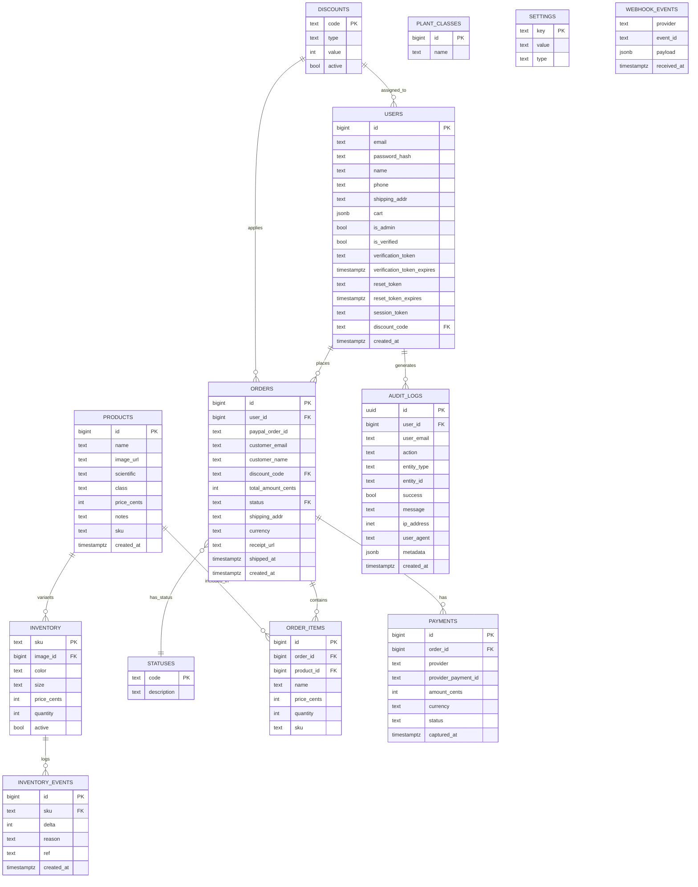

# System Design

This document reflects the **actual current database schema and architecture**
detected directly from the codebase.  
It also lists staged improvements that can be added incrementally.

For diagrams → `docs/diagrams.md`

---

## Current Architecture

## Stack

- Netlify Functions (TypeScript)
- Neon PostgreSQL
- React + Tailwind
- PayPal Checkout
- Cloudinary storage
- Plant AI provider

## Responsibilities

Functions:

- auth
- orders
- payments
- products
- admin
- uploads

Database is the single source of truth.

---

## Database Schema (Auto-synced)

## ER Diagram



---

## Runtime Flow

### Checkout

1. create-order
2. order stored in DB
3. PayPal order created
4. webhook confirms capture
5. inventory decremented inside transaction
6. inventory event logged

Inventory authority lives only in Neon.

---

## Staged Improvements Roadmap

These build on the current system safely.

---

### Phase 1 — Database Integrity & Performance

- **Indexes**:
  - `orders(user_id)` for fast customer history lookups.
  - `orders(created_at)` for sorting and reporting.
  - `inventory(sku)` for rapid stock checks.
  - `products(hidden)` for catalog filtering.
- **Constraints**:
  - Enforce `users.email` UNIQUE constraint.
  - Enforce `inventory.quantity >= 0` check constraint.
- **Foreign Keys**:
  - Ensure `ON DELETE RESTRICT` for `order_items -> products` to prevent deleting sold products.

---

### Phase 2 — Strong Inventory Guarantees

Prevent overselling using atomic database operations.

**Atomic Decrement:**

```sql
UPDATE inventory
SET quantity = quantity - $qty
WHERE sku = $sku
AND quantity >= $qty
RETURNING quantity;
```

Log:

```sql
INSERT INTO inventory_events (sku, delta, reason)
VALUES ($sku, -$qty, 'sale');
```

---

### Phase 3 — Admin Analytics

- top SKUs
- dead stock
- revenue charts
- fraud indicators

Stack:

- Recharts
- TanStack Table
- protected admin routes

---

### Phase 4 — Refunds & Chargebacks

Refund:

- add stock back
- inventory event (+qty)

Chargebacks:

- flag order
- manual review

---

### Phase 5 — Accounting

- CSV exports
- QuickBooks format
- currency normalization
- monthly revenue rollups

---

### Phase 6 — Security Hardening

- webhook signature verification
- JWT expiry rotation
- rate limiting
- row-level security
- admin-only policies

---

## Final State

Cactus operates as a production-grade commerce backend:

- Neon-backed authority
- append-only ledger
- idempotent webhooks
- refund-safe inventory
- analytics dashboards
- serverless scaling

No frontend UX changes required.
