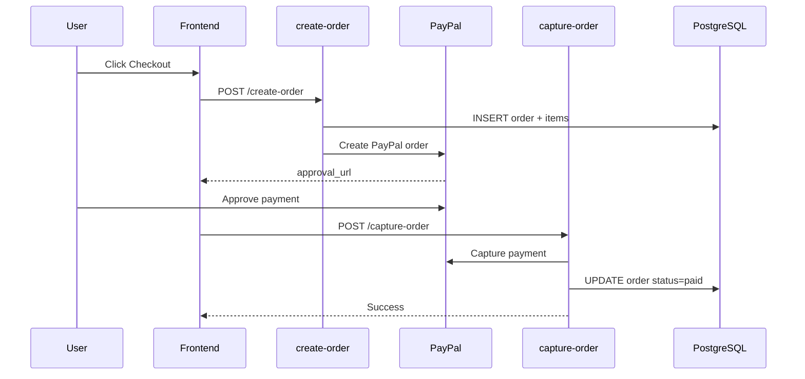
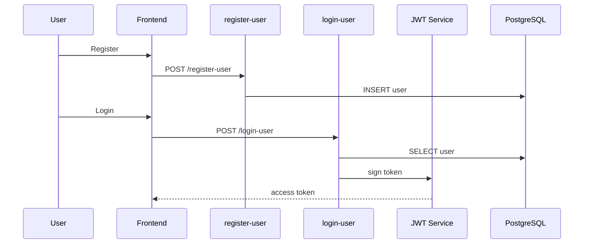
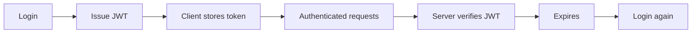
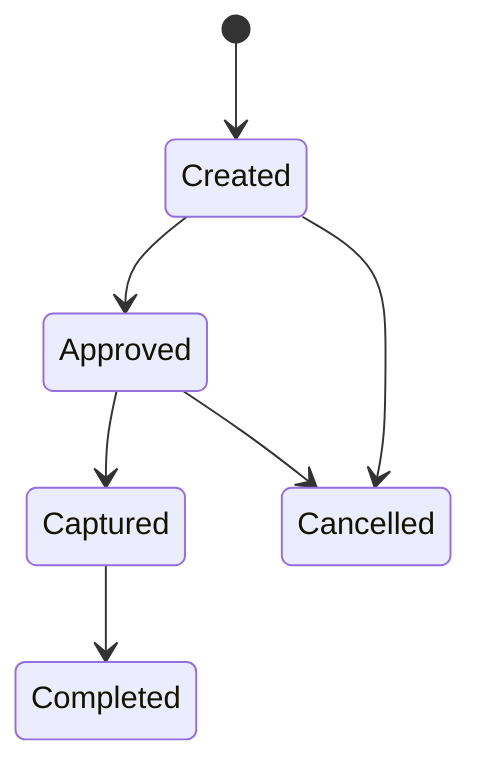
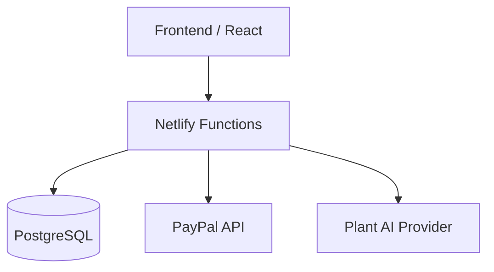
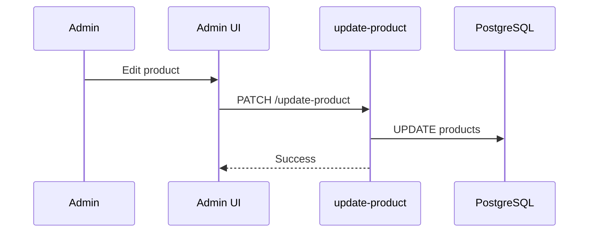
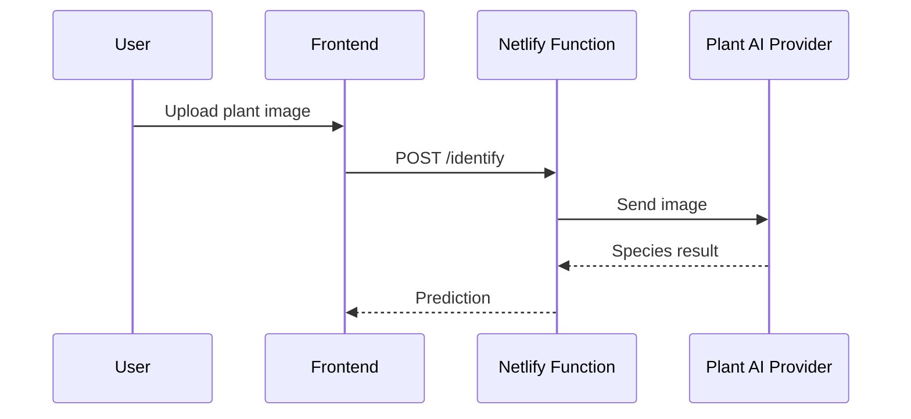
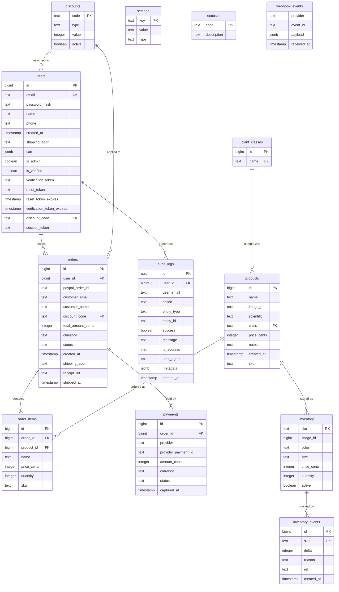

# Cactus System Diagrams

All system architecture, flows, and state machines for the Cactus platform.

---

## Checkout Flow (Order → PayPal → Capture)

---

## Auth Flow (Register + Login + JWT)

---

## JWT Lifecycle

---

## PayPal Payment State Machine

---

## Component / Architecture Diagram

---

## Admin Flow

---

## Plant AI Provider Flow

---

## ER Diagram (Database Schema)

